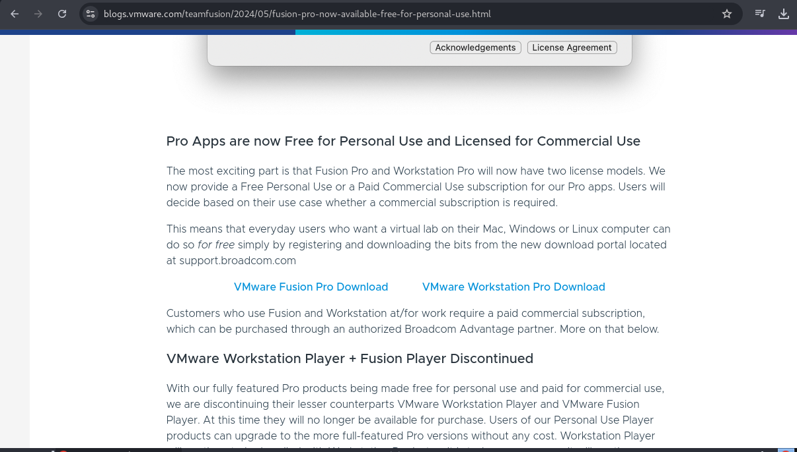
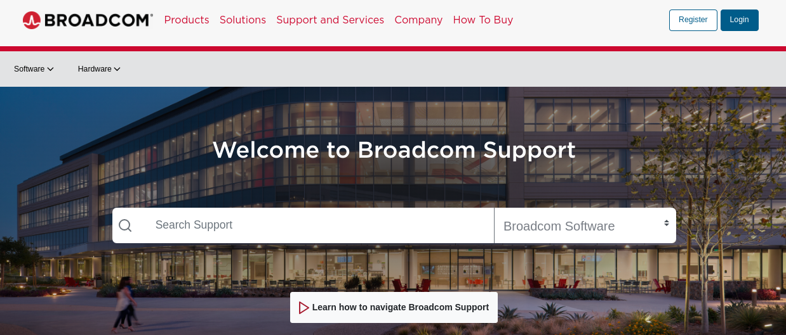
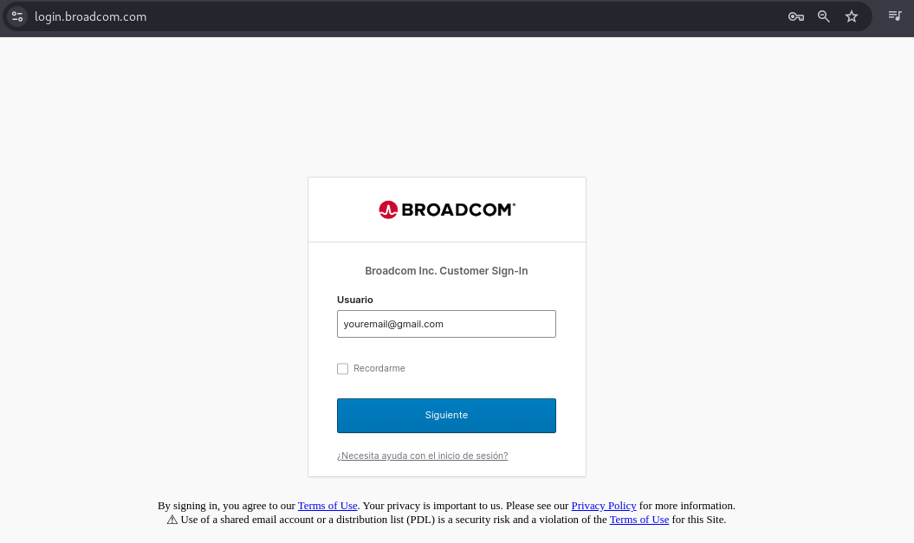
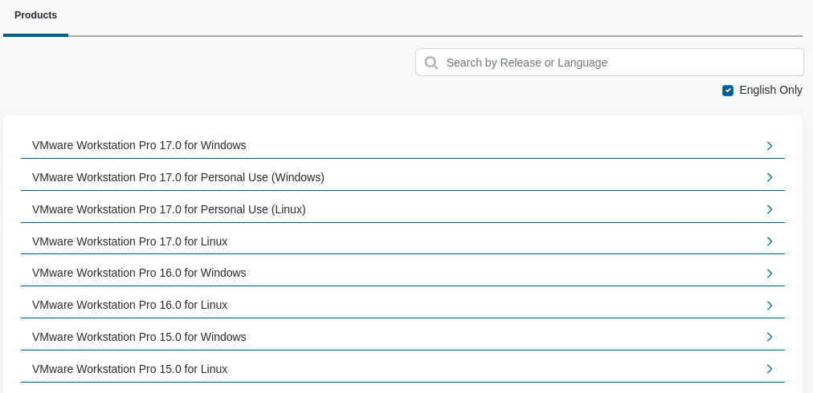

## 1. First step

Go to this blog and download the **VMware Workstation Pro Download**  
https://blogs.vmware.com/teamfusion/2024/05/fusion-pro-now-available-free-for-personal-use.html

## 2. Second step

Register on the **Broadcom** page  
https://support.broadcom.com/

## 3. Third Step

Log in to **Broadcom**  
https://access.broadcom.com/default/ui/v1/signin/idp/

## 4. Fourth Step

Choose the version you need  
https://support.broadcom.com/group/ecx/productdownloads?subfamily=VMware+Workstation+Pro

If you are on **Windows**: Follow the corresponding installation process.

If you are on **Linux**: 

~~~bash
sudo chmod +x VMware-Workstation-Full-17.6.1-24319023.x86_64.bundle
~~~

~~~bash
sudo ./VMware-Workstation-Full-17.6.1-24319023.x86_64.bundle
~~~
